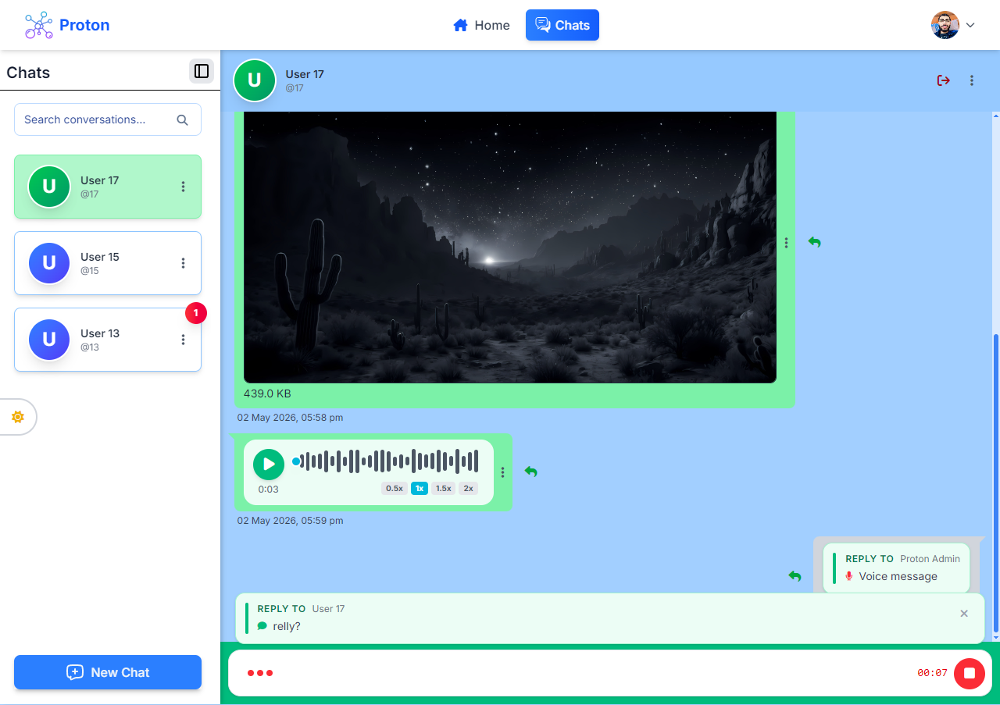
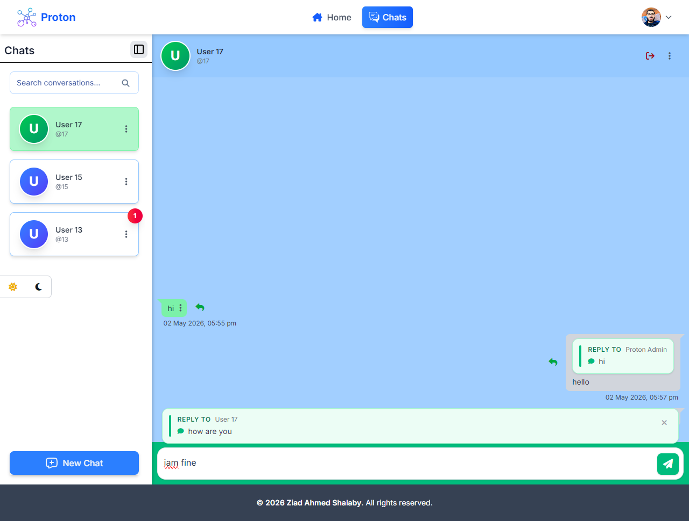
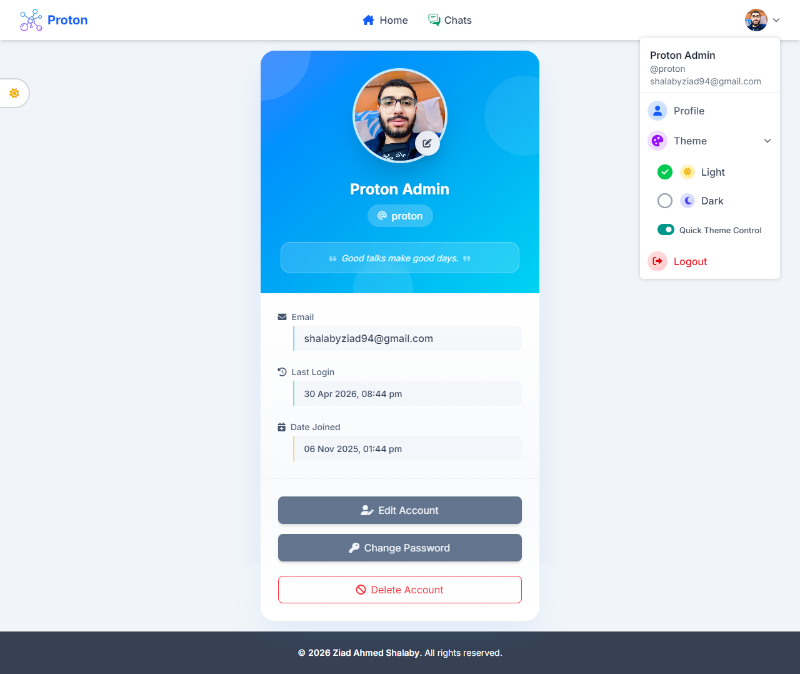

# 📱 Proton — Real-Time Chat & Video Calling

<p align="center">
  🎨 <b>Frontend</b> — <a href="https://github.com/ziadshalaby00/Angular-chat-project">Angular-chat-project</a>
  <br>
  ⚙️ <b>Backend</b> — <a href="https://github.com/ziadshalaby00/Django-Chat-project">Django-Chat-project</a>
</p>

> A full-stack real-time communication platform built with **Django** and **Angular 22**, featuring instant messaging, rich media sharing, WebRTC audio/video calling, and secure authentication.

<p align="center">
  
  
  
</p>

## ✨ Features

* 💬 Real-time messaging with WebSockets
* 📹 Peer-to-peer audio & video calling with WebRTC
* 📎 Text, voice, image, video, and file messages
* 🔐 JWT authentication with HTTP-only cookies
* 🔑 Google OAuth 2.0
* 📧 Email verification & password reset
* 👤 User profiles & chat management
* 🔔 Real-time notifications and unread counters
* 🌓 Dark / Light theme
* 📱 Responsive UI & PWA support

## 🏗️ Tech Stack

### Frontend

**Angular 22 · TypeScript · Signals · Tailwind CSS · WebRTC · WebSockets · PWA**

### Backend

**Django 5.2 · Django REST Framework · Django Channels · Daphne · Celery · Redis · SimpleJWT · FFmpeg**

## 🔄 Architecture

```text
┌──────────────────┐
│   Angular 22     │
│    Frontend      │
└────────┬─────────┘
         │ REST + WebSockets
         ▼
┌──────────────────┐
│    Django 5.2    │
│     Backend      │
└───────┬──────────┘
        │
   ┌────┴─────┐
   ▼          ▼
 Redis      Celery

       WebRTC
User A ◄──────────► User B
       Audio/Video
```

Django Channels handles real-time communication and WebRTC signaling, while WebRTC establishes the peer-to-peer media connection.

---

### 👨‍💻 Developed by [Ziad Shalaby](https://github.com/ziadshalaby00)
